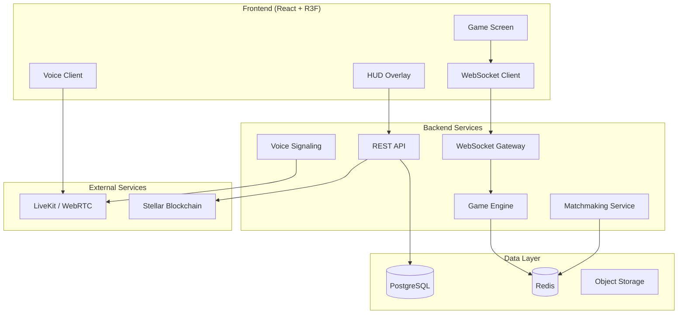
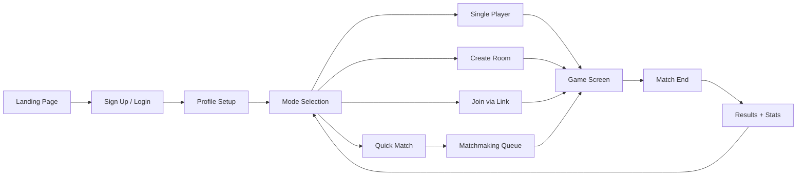
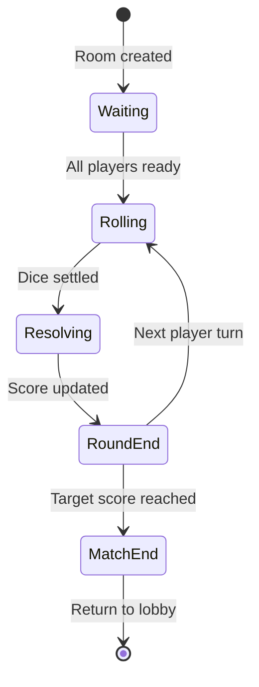
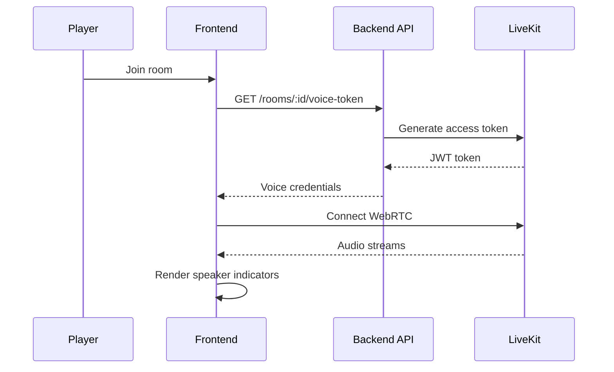
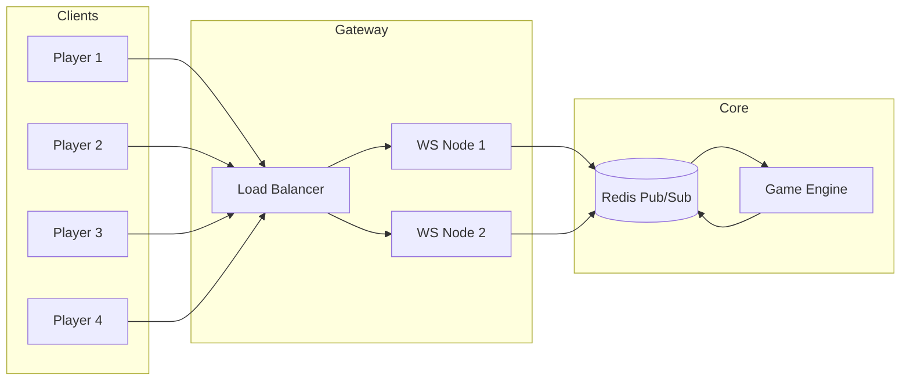
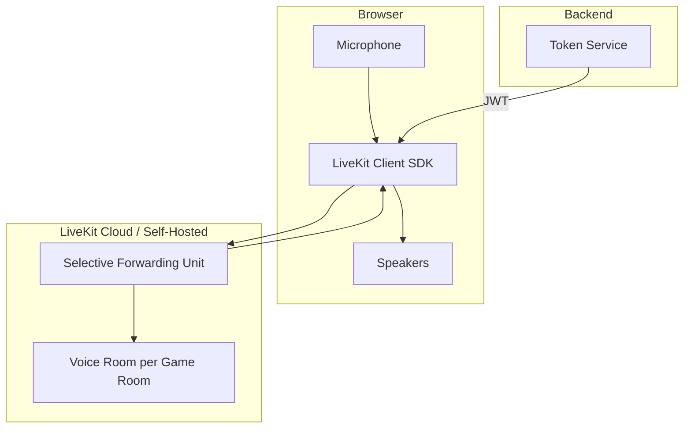

# StellarDice — Product Architecture

> Premium real-time multiplayer dice game platform combining casual gaming, social interaction, and competitive gameplay.

---

## 1. System Overview



---

## 2. User Flow Diagrams

### 2.1 Onboarding → First Match



### 2.2 In-Game Flow



### 2.3 Voice Chat Flow



---

## 3. Multiplayer System Design

### 3.1 Room Model

| Field        | Type | Description                                |
| ------------ | ---- | ------------------------------------------ |
| `id`         | UUID | Public room identifier (e.g. `ROOM-7X9K2`) |
| `mode`       | enum | `single`, `1v1`, `3player`, `4player`      |
| `host_id`    | UUID | Room creator                               |
| `is_private` | bool | Public vs invite-only                      |
| `state`      | enum | `waiting`, `active`, `finished`            |
| `settings`   | JSON | Target score, round limit, rules           |

### 3.2 Authoritative Server

The game engine runs server-side with client-side prediction for dice physics:

1. **Client** sends `roll_dice` intent via WebSocket
2. **Server** validates turn, generates seeded random values
3. **Server** broadcasts `dice_roll_started` to all clients
4. **Clients** run physics animation (cosmetic, server values win)
5. **Server** broadcasts `dice_roll_result` with authoritative totals
6. **Server** updates scores, advances turn

### 3.3 Matchmaking

```
Queue buckets: [1v1, 3player, 4player]
Each bucket: Redis sorted set by MMR

Algorithm:
1. Player joins queue with MMR + mode preference
2. Every 2s, matchmaker scans for compatible groups
3. MMR tolerance expands over wait time (±50 → ±200)
4. On match: create room, notify all players, start 10s ready check
```

### 3.3 Sync Strategy

| Data             | Transport             | Frequency    |
| ---------------- | --------------------- | ------------ |
| Game state       | WebSocket             | Event-driven |
| Dice rolls       | WebSocket             | Per roll     |
| Reactions/emotes | WebSocket             | Real-time    |
| Chat             | WebSocket             | Real-time    |
| Voice            | WebRTC (LiveKit)      | Continuous   |
| Presence         | WebSocket + heartbeat | 5s interval  |

---

## 4. Frontend Component Structure

```
frontend/src/
├── components/
│   ├── game/
│   │   ├── GameScreen.tsx       # Root game layout
│   │   ├── TopBar.tsx           # Room ID, timer, status
│   │   ├── BottomBar.tsx        # Roll, chat, emotes
│   │   ├── PlayerPanel.tsx      # Player cards + presence
│   │   ├── RollButton.tsx       # Primary CTA
│   │   └── RoundInfo.tsx        # Round history sidebar
│   ├── social/
│   │   ├── VoiceControls.tsx    # Mute, PTT, indicators
│   │   ├── ChatPanel.tsx        # In-game chat
│   │   ├── EmoteBar.tsx         # Reaction picker
│   │   └── ReactionOverlay.tsx  # Floating emojis
│   ├── lobby/                   # (Future) Room creation
│   └── ui/
│       └── RankBadge.tsx        # Competitive rank display
├── scenes/
│   ├── GameScene.tsx            # R3F Canvas root
│   ├── GameTable.tsx            # 3D board + player tokens
│   ├── DiceMesh.tsx             # Physics dice with pips
│   └── ParticleEffects.tsx      # Celebration particles
├── stores/
│   └── gameStore.ts             # Zustand game state
├── hooks/
│   └── useSound.ts              # Web Audio API
└── types/
    └── index.ts                 # Re-exports from dummy-data

dummy-data/                      # Mock data (swap for API later)
├── types.ts
├── players.ts
├── room.ts
├── emotes.ts
└── index.ts
```

---

## 5. Database Schema

```sql
-- Users
CREATE TABLE users (
    id            UUID PRIMARY KEY DEFAULT gen_random_uuid(),
    username      VARCHAR(32) UNIQUE NOT NULL,
    email         VARCHAR(255) UNIQUE NOT NULL,
    avatar_url    TEXT,
    rank          VARCHAR(16) DEFAULT 'bronze',
    mmr           INTEGER DEFAULT 1000,
    created_at    TIMESTAMPTZ DEFAULT NOW()
);

-- Player statistics
CREATE TABLE player_stats (
    user_id         UUID PRIMARY KEY REFERENCES users(id),
    games_played    INTEGER DEFAULT 0,
    games_won       INTEGER DEFAULT 0,
    current_streak  INTEGER DEFAULT 0,
    highest_streak  INTEGER DEFAULT 0,
    total_rewards   BIGINT DEFAULT 0,
    updated_at      TIMESTAMPTZ DEFAULT NOW()
);

-- Game rooms
CREATE TABLE rooms (
    id            VARCHAR(12) PRIMARY KEY,
    host_id       UUID REFERENCES users(id),
    mode          VARCHAR(16) NOT NULL,
    is_private    BOOLEAN DEFAULT FALSE,
    state         VARCHAR(16) DEFAULT 'waiting',
    settings      JSONB DEFAULT '{}',
    created_at    TIMESTAMPTZ DEFAULT NOW()
);

-- Room participants
CREATE TABLE room_players (
    room_id       VARCHAR(12) REFERENCES rooms(id),
    user_id       UUID REFERENCES users(id),
    seat          INTEGER NOT NULL,
    score         INTEGER DEFAULT 0,
    is_ready      BOOLEAN DEFAULT FALSE,
    joined_at     TIMESTAMPTZ DEFAULT NOW(),
    PRIMARY KEY (room_id, user_id)
);

-- Match history
CREATE TABLE matches (
    id            UUID PRIMARY KEY DEFAULT gen_random_uuid(),
    room_id       VARCHAR(12) REFERENCES rooms(id),
    winner_id     UUID REFERENCES users(id),
    mode          VARCHAR(16),
    final_scores  JSONB,
    duration_sec  INTEGER,
    created_at    TIMESTAMPTZ DEFAULT NOW()
);

-- Dice roll audit log
CREATE TABLE dice_rolls (
    id            UUID PRIMARY KEY DEFAULT gen_random_uuid(),
    match_id      UUID REFERENCES matches(id),
    user_id       UUID REFERENCES users(id),
    round         INTEGER,
    values        INTEGER[] NOT NULL,
    total         INTEGER NOT NULL,
    seed          VARCHAR(64),
    created_at    TIMESTAMPTZ DEFAULT NOW()
);

-- Monetization (future)
CREATE TABLE tournaments (
    id            UUID PRIMARY KEY DEFAULT gen_random_uuid(),
    name          VARCHAR(128),
    entry_fee     BIGINT,
    prize_pool    BIGINT,
    status        VARCHAR(16),
    starts_at     TIMESTAMPTZ,
    ends_at       TIMESTAMPTZ
);

CREATE TABLE battle_pass_seasons (
    id            UUID PRIMARY KEY DEFAULT gen_random_uuid(),
    name          VARCHAR(64),
    starts_at     TIMESTAMPTZ,
    ends_at       TIMESTAMPTZ,
    tiers         JSONB
);
```

---

## 6. API Design

### REST Endpoints

```
POST   /api/v1/auth/register
POST   /api/v1/auth/login
GET    /api/v1/users/me
PATCH  /api/v1/users/me
GET    /api/v1/users/:id/stats

POST   /api/v1/rooms                    # Create room
GET    /api/v1/rooms/:id                # Get room state
POST   /api/v1/rooms/:id/join         # Join room
POST   /api/v1/rooms/:id/leave        # Leave room
POST   /api/v1/rooms/:id/ready        # Toggle ready
GET    /api/v1/rooms/:id/voice-token  # LiveKit token

POST   /api/v1/matchmaking/queue      # Enter queue
DELETE /api/v1/matchmaking/queue      # Leave queue

GET    /api/v1/leaderboard            # Global rankings
GET    /api/v1/matches/:id            # Match replay data
```

### WebSocket Events

```typescript
// Client → Server
{ type: 'room:join', roomId: string }
{ type: 'game:roll_dice' }
{ type: 'game:ready' }
{ type: 'social:reaction', emoji: string }
{ type: 'social:chat', message: string }
{ type: 'presence:heartbeat' }

// Server → Client
{ type: 'room:state', data: RoomState }
{ type: 'game:turn_changed', playerId: string }
{ type: 'game:dice_roll_started', playerId: string }
{ type: 'game:dice_roll_result', roll: DiceRoll }
{ type: 'game:score_updated', scores: Record<string, number> }
{ type: 'game:match_ended', winner: Player, finalScores: Score[] }
{ type: 'social:reaction', reaction: Reaction }
{ type: 'social:chat', message: ChatMessage }
{ type: 'presence:updated', players: PresenceUpdate[] }
```

---

## 7. WebSocket Architecture



**Connection lifecycle:**

1. Client authenticates via JWT in WebSocket handshake
2. Gateway assigns to least-loaded node (sticky sessions by room)
3. Room events published to Redis channel `room:{id}`
4. All nodes subscribed to room channel forward to connected clients
5. Game engine processes intents, publishes state updates

---

## 8. Voice Chat Architecture

**Recommended: LiveKit** (self-hostable, excellent React SDK, built-in speaker detection)



**Features mapping:**
| Feature | Implementation |
|---------|---------------|
| In-room voice | LiveKit room = game room ID |
| Push-to-talk | Client-side: mute track unless PTT key held |
| Mute/unmute | `localParticipant.setMicrophoneEnabled()` |
| Speaker indicators | `participant.isSpeaking` event |
| Voice activity animation | Audio level from `AudioTrack` analyser |

---

## 9. UI/UX Wireframes

### Game Screen Layout (Desktop)

```
┌─────────────────────────────────────────────────────────────┐
│  ROOM-7X9K2  │  Round 4/10  │  Roll your dice!  │  ⏱ 5:42  🎤│
├─────────────────────────────────────────────────────────────┤
│ ┌──────────┐                              ┌──────────┐     │
│ │ 🎯 You   │                              │ 👑 King  │     │
│ │ Gold 18pt│         3D GAME TABLE          │ Dia. 25pt│     │
│ └──────────┘         + DICE ARENA          └──────────┘     │
│ ┌──────────┐                              ┌──────────┐     │
│ │ ⭐ Lucky │         (WebGL Scene)         │ 🔥 Nova  │     │
│ │ Silv 15pt│                              │ Plat 22pt│     │
│ └──────────┘                              └──────────┘     │
│                                          ┌────────────┐     │
│                                          │ Roll Hist  │     │
│                                          │ [6][5]=11  │     │
│                                          │ [4][3]=7   │     │
│                                          └────────────┘     │
├─────────────────────────────────────────────────────────────┤
│ ┌ Chat ──────┐        ┌─────────┐        🔥🚀😂😱🎉👏    │
│ │ Nova: GL!  │        │  🎲     │                          │
│ │ King: gooo │        │ROLL DICE│                          │
│ └────────────┘        └─────────┘                          │
└─────────────────────────────────────────────────────────────┘
```

### Mobile Layout

```
┌─────────────────────┐
│ ROOM-7X9K2  ⏱ 5:42 │
│   Roll your dice!    │
├─────────────────────┤
│ ┌─────┐   ┌─────┐  │
│ │ You │   │Nova │  │
│ │ 18  │   │ 22  │  │
│ └─────┘   └─────┘  │
│                     │
│    [ 3D SCENE ]     │
│                     │
│ ┌─────┐   ┌─────┐  │
│ │Lucky│   │King │  │
│ │ 15  │   │ 25  │  │
│ └─────┘   └─────┘  │
├─────────────────────┤
│      ┌───────┐      │
│      │  🎲   │      │
│      │ ROLL  │      │
│      └───────┘      │
│  🔥 🚀 😂 😱 🎉    │
└─────────────────────┘
```

---

## 10. 3D Game Screen Design

### Visual Layers (back to front)

1. **Environment** — Starfield, night HDRI, ambient particles
2. **Table** — Wood border, green felt arena, corner color lanes (Ludo-inspired)
3. **Player tokens** — 3D cylinders with emoji avatars, turn glow rings
4. **Dice arena** — Physics collider bounds, invisible walls
5. **Dice** — Rounded box meshes, pip faces, Rapier physics
6. **Effects** — Contact shadows, celebration particles, floating reactions
7. **HUD** — Glass-morphism overlay panels (CSS, not 3D)

### Camera Behavior

| Event       | Camera                            |
| ----------- | --------------------------------- |
| Idle        | Elevated 45° overview `[0, 5, 5]` |
| Rolling     | GSAP zoom to `[0, 4.5, 3.5]`      |
| Win         | Orbit + particle burst            |
| Turn change | Subtle pan toward active player   |

### Material Palette

| Element      | Color     | Material      |
| ------------ | --------- | ------------- |
| Table wood   | `#2a1810` | Roughness 0.6 |
| Felt arena   | `#1a3a2a` | Roughness 0.9 |
| Dice (white) | `#f8f8ff` | Metalness 0.1 |
| Dice (black) | `#1a1a2e` | Metalness 0.1 |
| Gold accent  | `#f59e0b` | Emissive 0.15 |

---

## 11. Recommended Tech Stack

### Frontend

| Layer     | Technology                          |
| --------- | ----------------------------------- |
| Framework | React 18 + TypeScript               |
| Build     | Vite                                |
| 3D        | Three.js + React Three Fiber + Drei |
| Physics   | Rapier (@react-three/rapier)        |
| Animation | GSAP + Framer Motion                |
| State     | Zustand                             |
| Audio     | Web Audio API                       |
| Voice     | LiveKit React SDK                   |
| Styling   | CSS Modules + CSS Variables         |

### Backend

| Layer       | Technology                    |
| ----------- | ----------------------------- |
| API         | Node.js (Fastify) or Go       |
| WebSocket   | Socket.io or uWebSockets      |
| Database    | PostgreSQL                    |
| Cache/Queue | Redis                         |
| Voice       | LiveKit Server                |
| Auth        | JWT + OAuth (Google, Discord) |
| Deploy      | Docker + Kubernetes           |

### Infrastructure

| Service    | Provider                       |
| ---------- | ------------------------------ |
| Hosting    | Vercel (FE) + Railway/Fly (BE) |
| CDN        | Cloudflare                     |
| Monitoring | Sentry + Datadog               |
| CI/CD      | GitHub Actions                 |

### Blockchain (Future)

| Layer     | Technology                      |
| --------- | ------------------------------- |
| Network   | Stellar (existing repo context) |
| Contracts | Soroban (Rust)                  |
| Wallet    | Freighter                       |

---

## 12. Development Roadmap

### Phase 1 — MVP (4-6 weeks) ✅ Frontend prototype

- [x] 3D game screen with physics dice
- [x] HUD layout (top/center/bottom)
- [x] Dummy data integration
- [x] Player presence UI
- [x] Reactions + chat UI
- [x] Voice controls UI (mock)
- [ ] Backend API scaffold
- [ ] WebSocket game sync
- [ ] User auth

### Phase 2 — Multiplayer Core (4-6 weeks)

- [ ] Room creation + invite links
- [ ] Real-time game state sync
- [ ] Matchmaking queue
- [ ] 1v1 and 4-player modes
- [ ] LiveKit voice integration
- [ ] Server-authoritative dice

### Phase 3 — Competitive (3-4 weeks)

- [ ] Ranking system (Bronze → Diamond)
- [ ] Player statistics dashboard
- [ ] Global leaderboard
- [ ] Match history + replays
- [ ] Anti-cheat validation

### Phase 4 — Social & Polish (3-4 weeks)

- [ ] Single player AI (adaptive difficulty)
- [ ] Tutorial mode
- [ ] Sound design + music
- [ ] Mobile optimization
- [ ] Performance profiling (60fps target)

### Phase 5 — Monetization (4-6 weeks)

- [ ] Tournament mode
- [ ] Entry fees + reward pools
- [ ] Battle Pass seasons
- [ ] NFT avatar support
- [ ] Stellar/USDC integration
- [ ] Seasonal events

### Phase 6 — Production (ongoing)

- [ ] Load testing (1000+ concurrent rooms)
- [ ] Global deployment
- [ ] Analytics pipeline
- [ ] A/B testing framework
- [ ] App store (PWA / Capacitor)

---

## Running the Frontend

```bash
cd frontend
npm install
npm run dev
# Open http://localhost:5000
```

The game screen loads with dummy data from `dummy-data/`. Replace store initialization with API/WebSocket calls when backend is ready.
